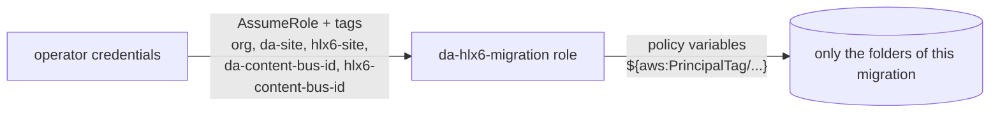

# 01 - Access & tooling

## da backend
| Item | Value | Source |
|---|---|---|
| Storage | Cloudflare R2, S3-compatible API | da-admin `src/storage/utils/config.js` |
| Bucket | `env.AEM_BUCKET_NAME` → `aem-content` in prod | da-admin `src/utils/daCtx.js` |
| Credentials | `S3_ACCESS_KEY_ID`, `S3_SECRET_ACCESS_KEY`, `S3_DEF_URL` (endpoint), region `auto`, `forcePathStyle` | da-magic `traverse/s3-utils.js` (read from `.dev.vars`) |
| Config | Cloudflare KV `DA_CONFIG`, **not** in R2 | da-admin `src/storage/kv/*` |
| API | `https://admin.da.live/source/{org}/{site}/...` | |

## hlx6 backend
| Item | Value | Source |
|---|---|---|
| Storage | AWS S3 via `@adobe/helix-shared-storage` 2.1.5 | helix-api-service |
| Source bucket | `bucketMap.source`; defaults to **`helix-source-bus`** unless `HELIX_BUCKET_NAMES` (JSON) overrides it | shared-storage `parseBucketNames()` |
| Media bucket | `bucketMap.media` → `helix-media-bus` | `storage.mediaBus()` |
| R2 mirror | `sourceBus(disableR2 = true)` → **no R2 mirror** for source; S3 only | shared-storage `storage.js` |
| Credentials | AWS KLAM role, account `118435662149`, region `us-east-1`, from `~/.aws/credentials` (temporary, refresh when expired). Read on `helix-source-bus` verified | - |
| API | `https://api.aem.live/{org}/sites/{site}/source/...` | helix-api-service `src/index.js` |
| Site is hlx6? | `GET {HLX_ADMIN}/ping/{org}/{site}` returns the `x-api-upgrade-available` header | da-nx `nx2/utils/api.js` `isHlx6()` |

The prod bucket names must be confirmed from the deployed `HELIX_BUCKET_NAMES`.

## da-magic utils to copy
| Util | Purpose | Action |
|---|---|---|
| `traverse/s3-utils.js` | R2 client (keep-alive, 500 sockets), `.dev.vars` loader, listing | Copy and port to ESM; generalize to "S3-compatible client" for both R2 and S3 |
| `traverse/sharding.js` (+ test) | Prefix sharding for parallel listing of huge buckets | Copy as-is (ESM) |
| `traverse/traverse.js`, `list-folder.js` | Recursive listing | Copy and adapt |
| `read-s3-document.sh`, `read-s3-versions.sh` | Ad-hoc reads | Replace with Node CLIs |
| `encoding/*` | gzip detection and fixing | Reference only: hlx6 stores gzip bodies |

## Gate before Phase 3
Read-only access verified on both sides (2026-10-01). R2 credentials: `.dev.vars` at the repo root (git-ignored, symlink to da-magic's) or `--dev-vars` / `$DA_DEV_VARS`.

## Migration identity: one shared role, scoped per migration

The migration never runs with a personal role, which can write anywhere in the account. It uses **one** role, `da-hlx6-migration`, created once. The role **has no access by itself**: every permission is tied to STS **session tags** that the tooling sets when it assumes the role for a given migration.



Three independent layers:
1. **Trust policy** ([infra/aws/trust-policy.json](../infra/aws/trust-policy.json)): the role can only be assumed by the operator role, and only with **all 5 tags** set, no extra tag and no `/` in a value.
2. **Role policy** ([infra/aws/migration-role-policy.json](../infra/aws/migration-role-policy.json)): every resource is built from the tags, and a missing tag is an explicit Deny. Deleting and reconfiguring are always denied.
3. **Code** (`src/scope.js`): validates the values (`[a-z0-9-]`, hex ids, da ≠ hlx6 media folder) and refuses any write outside the scope before calling AWS.

### What one migration session can do

| Bucket | Folder (from tags) | List | Read | Write |
|---|---|---|---|---|
| `helix-source-bus` | `{org}/{hlx6-site}/` (hlx6 site) | yes | yes | yes |
| `helix-media-bus` | `{da-content-bus-id}/` (da site media) | yes | yes | **no** |
| `helix-media-bus` | `{hlx6-content-bus-id}/` (hlx6 site media) | yes | yes | **no** (images go through the media API, see [04 §8](04-migration-rules.md#8-images-r9-upload-procedure)) |
| `helix-config-bus` | `orgs/{org}/sites/{da-site}.json`, `{hlx6-site}.json` | no | yes | **no** |
| anything else | - | no | no | no |

Example tags for the test: `org=kptdobe`, `da-site=sample-content-da`, `hlx6-site=sample-content-hlx6-migrated`, `da-content-bus-id=cdb7c31a…`, `hlx6-content-bus-id=8a228067…`.

Notes:
- Writes are `PutObject` on the hlx6 site in the source bus only.
- Buckets use SSE-S3 (`AES256`), so no KMS permission is needed. Both buckets have **versioning enabled**, so an overwrite in the hlx6 site can be rolled back by an admin.
- Cleaning up an hlx6 site is done by an admin, never by this role.
- Role chaining caps a session at 1 h. The tooling refreshes credentials automatically, with the same tags (`createMigrationClient`).
- The da side (R2) is read-only and does not go through this role (see below).

### Remaining risk
Whoever can assume the role chooses the tags, so **the trust policy principal is the real security boundary**: restrict it to the operator role(s) that run migrations. A wrong but valid tag value (e.g. another existing site) would be accepted by IAM. The tooling therefore:
- resolves `da-content-bus-id` and `hlx6-content-bus-id` from the config bus itself instead of taking them as input, and
- refuses to write into an hlx6 site that already has content not produced by the migration (pre-flight, to be added with the writer).

Not verified yet: whether a `*` inside a substituted tag value acts as a wildcard. The code rejects such values, and the deny checks below test it explicitly.

### Creating it (once, by an account admin)
```bash
# set the operator principal in infra/aws/trust-policy.json first
aws iam create-role --role-name da-hlx6-migration \
  --assume-role-policy-document file://infra/aws/trust-policy.json \
  --max-session-duration 3600
aws iam put-role-policy --role-name da-hlx6-migration \
  --policy-name da-hlx6-migration \
  --policy-document file://infra/aws/migration-role-policy.json
```

### Verification before the first write
Run as the operator. Assume with the test tags, then check that each of these is **AccessDenied**:
- list `s3://helix-source-bus/kptdobe/sample-content-hlx6/` (the reference site)
- put into `helix-source-bus/kptdobe/sample-content-hlx6/`
- put into `helix-media-bus/{da-content-bus-id}/`
- delete in `helix-source-bus/kptdobe/sample-content-hlx6-migrated/`
- AssumeRole without tags, with a missing tag, or with `hlx6-site=*`

And that listing and putting into `kptdobe/sample-content-hlx6-migrated/` succeed.

### R2 (da side, read only)
R2 API tokens can be scoped per bucket, not per prefix. Use a **new token**: "Object Read only" on `aem-content`, with an expiry. Do not use the da-magic token, which has broader rights. Store it in this repo's `.dev.vars` (git-ignored). The tooling never writes to R2: there is no R2 write path in the code.
